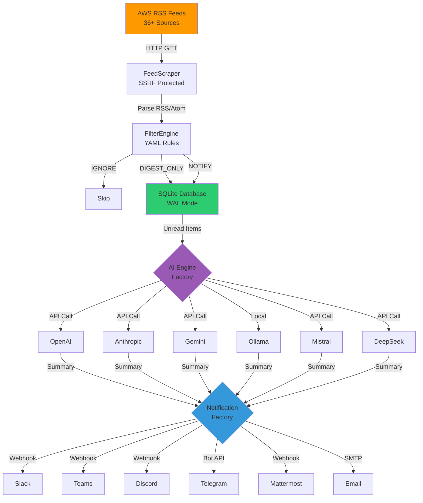

<p align="center">
  <h1 align="center">AWS-Brief 🚀</h1>
  <p align="center"><strong>The Elite Cloud Intelligence Feed</strong></p>
  <p align="center">
    <em>Autonomous, AI-Powered, Multi-Channel Intelligence for Cloud Architects & DevOps Teams.</em>
  </p>
  <p align="center">
    <a href="https://www.python.org/">
      
    </a>
    <a href="https://www.docker.com/">
      
    </a>
    <a href="#">
      
    </a>
    <a href="https://github.com/mhmtayberk/aws-brief/actions/workflows/ci.yml">
      
    </a>
    <a href="./LICENSE">
      
    </a>
  </p>
</p>

<br>

---

## 📑 Table of Contents

- [What is this?](#-what-is-this)
- [Features](#-features)
- [Installation & Usage](#-installation--usage)
  - [Docker](#docker)
  - [Local Python](#local-python)
- [CLI Reference](#-cli-reference)
- [Smart Digest](#-smart-digest-ai-powered)
- [Filtering](#-filtering-noise-cancellation)
- [Configuration](#️-configuration-env)
- [Architecture](#-architecture)
- [Security](#-security)
- [Contributing](#-contributing)
- [License](#-license)

---

## 🧐 What is this?

**AWS-Brief** is an automated "AI Analyst" that lives in your terminal. It monitors **36+ official AWS feeds** (Security Bulletins, Architecture Blog, etc.), uses advanced AI to filter the noise, and tells you exactly what matters.

> *"Here is the one critical Security update you need to patch today, and here are 4 cost-saving opportunities."*

---

## ✨ Features

<table>
  <tr>
    <td align="center">🧠 <strong>7+ AI Models</strong></td>
    <td align="center">🛡️ <strong>Noise Cancellation</strong></td>
    <td align="center">📢 <strong>Multi-Channel</strong></td>
  </tr>
  <tr>
    <td>Switch instantly between <strong>Ollama, OpenAI, Anthropic, Gemini, Groq, Mistral, DeepSeek</strong>. Privacy-first local inference supported.</td>
    <td><strong>Granular Regex Filtering</strong> to mute standard updates. <strong>Smart Init</strong> prevents historical spam.</td>
    <td>Rich notifications on <strong>Slack, Teams, Discord, Telegram, Mattermost, and Email</strong>.</td>
  </tr>
</table>

---

## 🚀 Installation & Usage

### Docker

The easiest way to run. Handles database and auto-restarts.

```bash
git clone https://github.com/mhmtayberk/aws-brief.git
cd aws-brief
cp .env.example .env 
# Edit .env and filters.yaml.example

docker-compose up -d --build
```

#### Useful Docker Commands

```bash
# View Logs (Watch the AI work)
docker-compose logs -f app

# Run a manual scan immediately
docker-compose exec app python main.py scan

# Send a Weekly Digest manually
docker-compose exec app python main.py send-digest --days 7 --channels slack

# Verify Configuration
docker-compose exec app python main.py verify-config
```

---

### Local Python

For running directly on your machine or VPS.

```bash
python3 -m venv venv && source venv/bin/activate
pip install -r requirements.txt
cp .env.example .env

# Initialize Database
python main.py init-db
python main.py mark-all-read --yes # Skip old news
```

> **Note:** If you want to use the **Transformers** engine for local AI inference, you'll need to install PyTorch separately:
> ```bash
> pip install torch --index-url https://download.pytorch.org/whl/cpu
> ```

#### Automate with Cron (Mac/Linux)

Add to your `crontab -e`:

```bash
# Hourly Check
0 * * * * cd /path/to/aws-brief && venv/bin/python main.py process-cycle

# Monday Morning Digest
0 9 * * 1 cd /path/to/aws-brief && venv/bin/python main.py send-digest --days 7
```

---

## 🛡️ Noise Cancellation (Filtering)

Don't want to hear about **GovCloud** or **Test Regions**?
Rename `filters.yaml.example` to `filters.yaml` and add your rules.

**Supported Actions:**

- `IGNORE`: Completely skips the item. No database entry, no notification.
- `DIGEST_ONLY`: Saves for Weekly Summary, but mutes real-time alerts.
- `NOTIFY`: (Default) Sends immediate alert.

**Example `filters.yaml`:**

```yaml
rules:
  - name: "Ignore GovCloud"
    match:
      title_regex: ".*GovCloud.*"
    action: IGNORE

  - name: "Digest Only Updates"
    match:
      title_regex: ".*EC2 Instance Type.*"
    action: DIGEST_ONLY
```

---

## ⚙️ Configuration (.env)

| Key | Description | Example |
| :--- | :--- | :--- |
| `DEFAULT_AI_ENGINE` | Which provider to use. | `ollama`, `openai`, `anthropic`, `mistral`, `deepseek` |
| `DEFAULT_AI_MODEL` | Specific model ID. | `llama3.3`, `gpt-4o-mini`, `claude-3-5-sonnet`, `mistral-large-latest`, `deepseek-chat` |
| `DEFAULT_NOTIFY_CHANNELS` | Notification channels (comma-separated). | `slack`, `telegram`, `discord`, `mattermost` |
| `SLACK_WEBHOOK_URL` | For Slack alerts. | `https://hooks.slack.com/...` |
| `TELEGRAM_BOT_TOKEN` | Telegram Bot API token. | `123456:ABC-DEF...` |
| `TELEGRAM_CHAT_ID` | Telegram chat/channel ID. | `-1001234567890` |
| `MATTERMOST_WEBHOOK_URL` | Mattermost incoming webhook URL (optional). | `https://mattermost.com/hooks/xxx` |
| `WEBHOOK_URL` | Generic webhook endpoint (optional). | `https://your-app.com/webhook` |
| `WEBHOOK_SECRET` | HMAC signature secret (optional). | `your-secret-key` |
| `MISTRAL_API_KEY` | Mistral AI API key (optional). | `...` |
| `DEEPSEEK_API_KEY` | DeepSeek API key (optional). | `...` |
| `SUMMARY_LANGUAGE` | Output language. | `English`, `Turkish`, `German` |
| `SCAN_INTERVAL` | Seconds between Docker checks. | `900` (15 mins) |

---

## 💻 CLI Reference

If you want to use the tool manually (or build your own scripts), here are the available commands:

| Command | Description | Example |
| :--- | :--- | :--- |
| `--help` | Show all available commands. | `python main.py --help` |
| `init-db` | Initializes the SQLite database. | `python main.py init-db` |
| `scan` | Checks RSS feeds for new items. | `python main.py scan --url "http://..."` |
| `list-news` | Shows latest headlines in terminal. | `python main.py list-news --limit 20` |
| `summarize` | AI summarizes a specific item by ID. | `python main.py summarize --item-id 123` |
| `send-digest` | Generates a report for past N days. | `python main.py send-digest --days 7 --channels slack` |
| `send-smart-digest` | AI-powered digest with categorization. | `python main.py send-smart-digest --days 7 --channels slack` |
| `export` | Export news items to file (JSON/CSV/MD/TXT). | `python main.py export --format json --days 7` |
| `process-cycle` | Runs Scan -> Summarize -> Notify loop. | `python main.py process-cycle` |
| `mark-all-read`| Marks history as "notified". | `python main.py mark-all-read --yes` |
| `verify-config`| Self-diagnostic check for API/DB. | `python main.py verify-config` |

---

## 📸 See It In Action

### Rich Notifications
>
> **🚨 [HIGH] AWS Security: ALB Invalid Header Drop**
>
> **What:** AWS Application Load Balancer now supports "Drop Invalid Header Fields" to prevent HTTP Desync attacks.
> **Why:** Attackers can use malformed headers to bypass security controls or poison backend caches.
> **Impact:** HIGH (Potential for Request Smuggling)
> **Action:** Enable `routing.http.drop_invalid_header_fields.enabled` on all public ALBs.
>
> [Read Full Story]

---

## 🏗️ Architecture



---

## 🔧 Troubleshooting

### Common Issues

#### 1. AI Engine Not Working

**Symptom**: `OpenAI API error: Incorrect API key provided`

**Solution**:
- Check `.env` file: `OPENAI_API_KEY=sk-...`
- Verify API key is valid: https://platform.openai.com/api-keys
- Try different engine: `python main.py summarize --item-id 123 --engine ollama`
- Check logs: `docker-compose logs -f app`

---

#### 2. No Notifications Received

**Symptom**: Scan completes but no Slack/Teams/Discord message

**Solution**:
- Check webhook URL in `.env`: `echo $SLACK_WEBHOOK_URL`
- Test webhook manually:
  ```bash
  curl -X POST $SLACK_WEBHOOK_URL \
    -H 'Content-Type: application/json' \
    -d '{"text":"Test from AWS-Brief"}'
  ```
- Verify channels: `DEFAULT_NOTIFY_CHANNELS=slack,telegram`
- Check logs for errors: `docker-compose logs -f app | grep -i error`

---

#### 3. Database Locked Error

**Symptom**: `sqlite3.OperationalError: database is locked`

**Solution**:
- Stop all running instances: `docker-compose down`
- WAL mode is enabled by default (automatic recovery)
- For multi-instance: Use PostgreSQL instead of SQLite
- Check file permissions: `ls -la *.db`

---

#### 4. Out of Memory (Docker)

**Symptom**: Docker container crashes, `OOMKilled` in logs

**Solution**:
- Increase Docker memory limit:
  ```yaml
  # docker-compose.yml
  services:
    app:
      mem_limit: 2g
  ```
- Use lighter AI model: `llama3.3:8b` instead of `llama3.3:70b`
- Reduce batch size in smart digest

---

#### 5. Rate Limit Exceeded

**Symptom**: `RateLimitError: Rate limit reached for requests`

**Solution**:
- Reduce scan frequency: `SCAN_INTERVAL=1800` (30 mins)
- Use cheaper model: `gpt-4o-mini` instead of `gpt-4`
- Adjust rate limits in `.env`:
  ```bash
  AI_RATE_LIMIT_CALLS=50
  AI_RATE_LIMIT_PERIOD=60
  ```
- Fallback is automatic (OpenAI → Anthropic → Ollama)

---

#### 6. SSL Certificate Error

**Symptom**: `SSLError: certificate verify failed`

**Solution**:
- Update certificates:
  ```bash
  pip install --upgrade certifi
  ```
- Check system time: `date` (must be accurate)
- For corporate proxy: Set `REQUESTS_CA_BUNDLE` env var

---

### Need More Help?

- 📖 Check [Contributing Guide](CONTRIBUTING.md)
- 🔒 Security issues: See [Security Policy](SECURITY.md)
- 💬 Open an issue: [GitHub Issues](https://github.com/mhmtayberk/aws-brief/issues)

---


## 🤝 Contributing

We welcome contributions! Please see our [Contributing Guide](CONTRIBUTING.md) for details on:

- How to set up your development environment
- Code style guidelines
- Testing requirements
- Pull request process

For security vulnerabilities, please see our [Security Policy](SECURITY.md).

---

## ⚖️ License

Distributed under the **MIT License**. See `LICENSE` for more information.
